# ERD (Entity Relationship Diagram)

## 목차

- [헬스 체크](#헬스-체크)
- [서비스 도입 문의](#서비스-도입-문의)
- [계정](#계정)
- [매장 등록](#매장-등록)
- [매장](#매장)
- [메뉴](#메뉴)
- [기기](#기기)
- [웨이팅](#웨이팅)
- [주문](#주문)
- [주문 결제](#주문-결제)
- [POS](#POS)

---

## 헬스 체크

_apk_version_

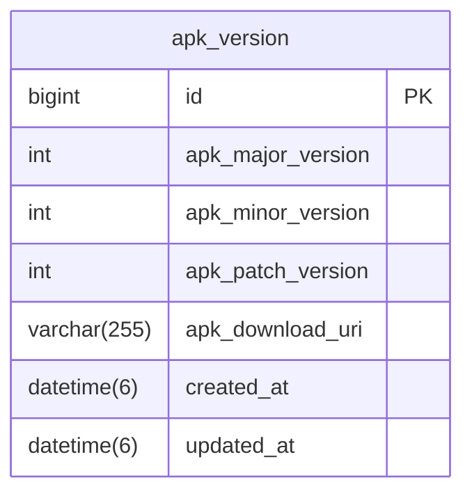

---

## 서비스 도입 문의

_contact_

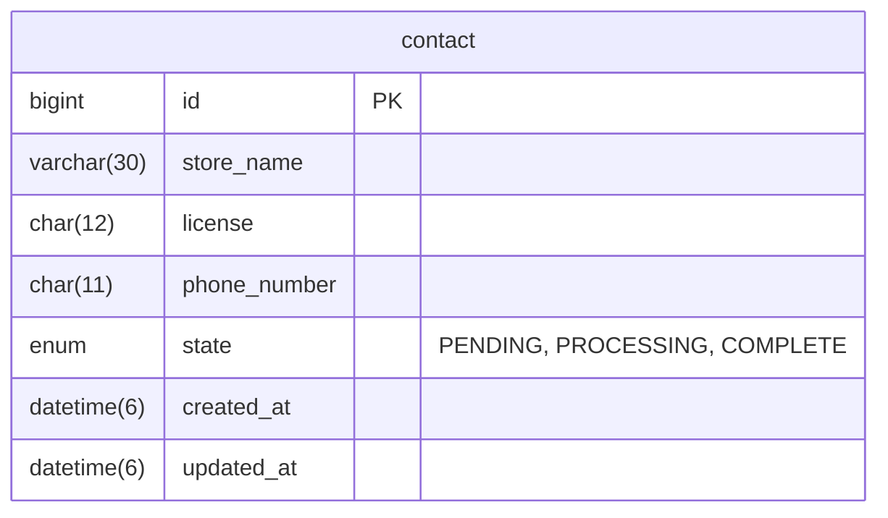

---

## 계정

_account_

_refresh_token_

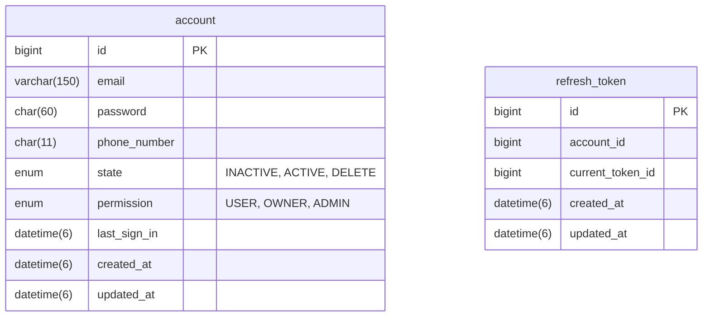

---

## 매장 등록

_store_registration_

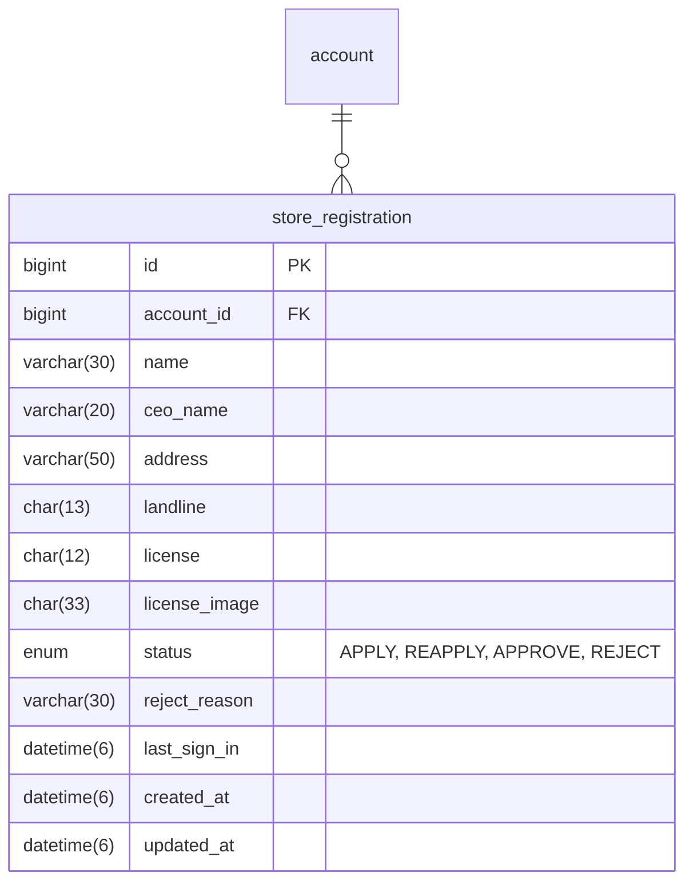

## 매장

_store_

_store_setting_

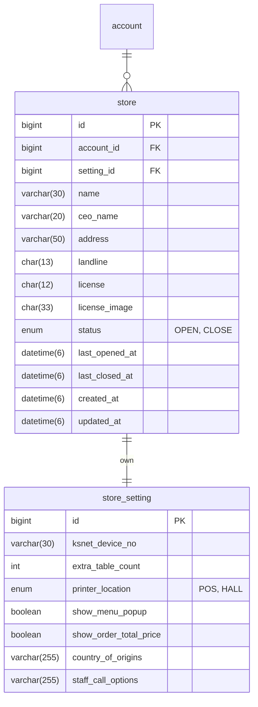

---

## 메뉴

_category_

_menu_

_menu_option_group_

_menu_option_

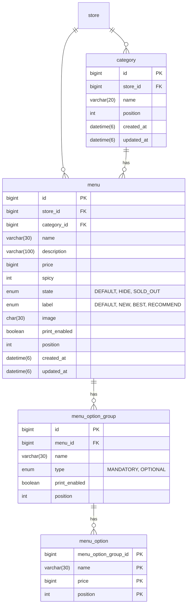

---

## 기기

_device_

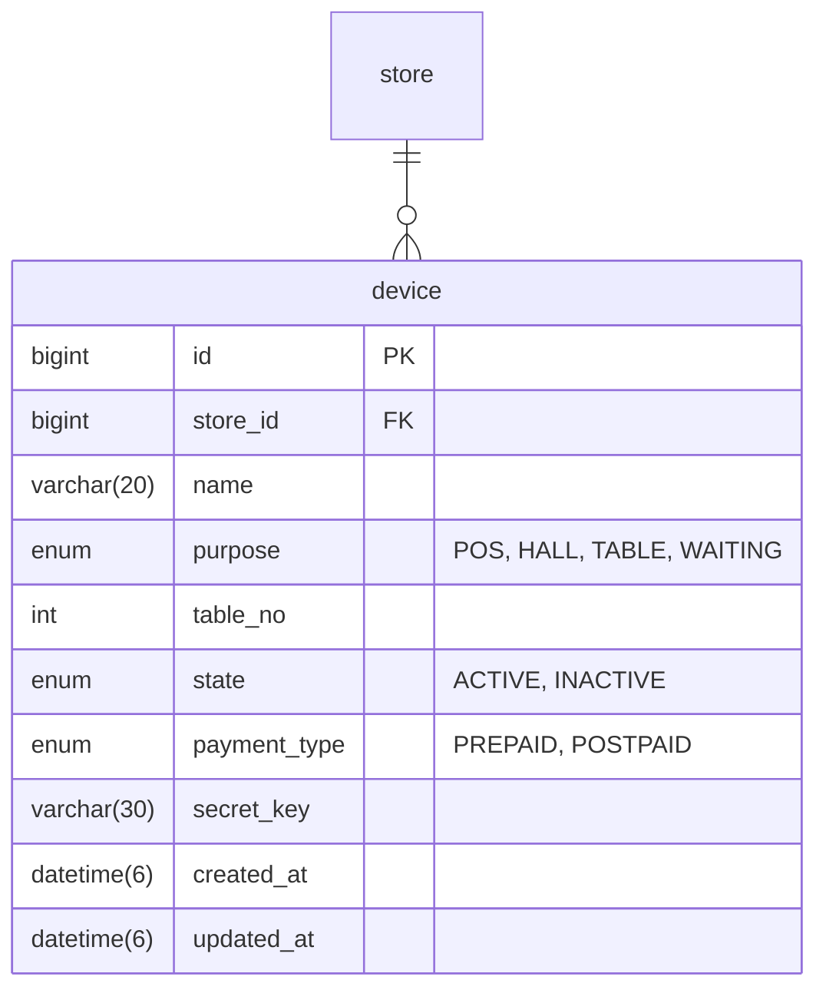

---

## 웨이팅

_waiting_

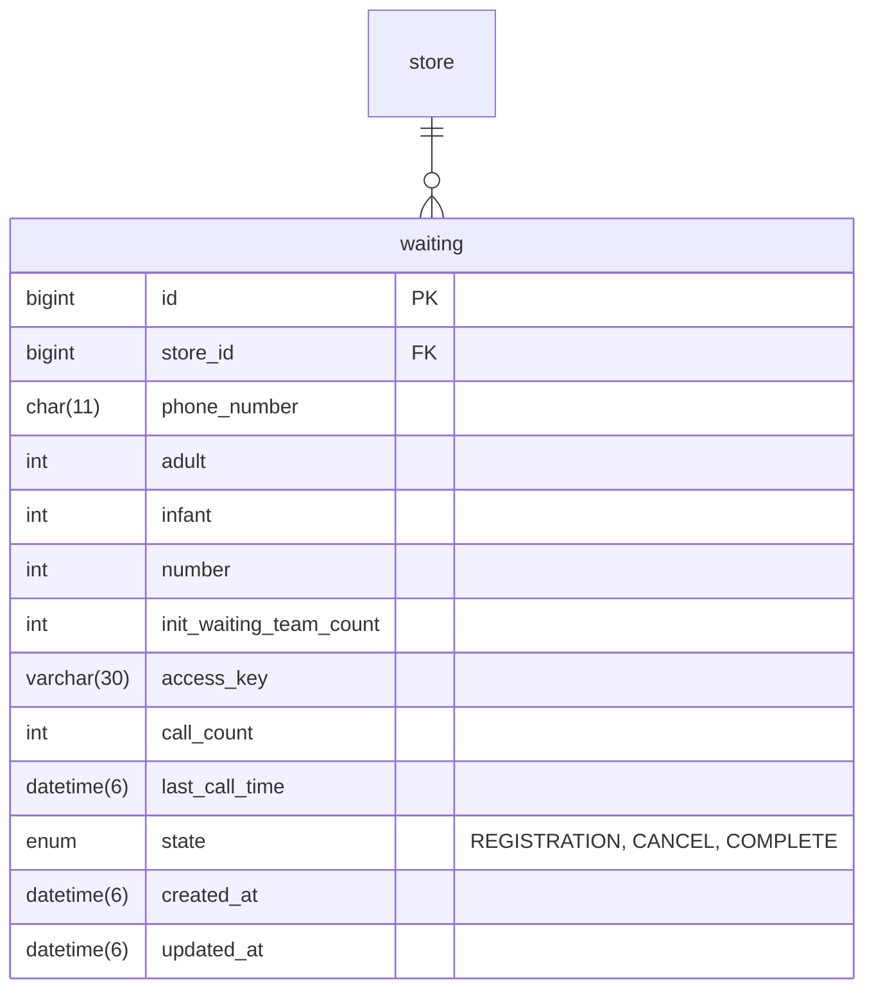

---

## 주문

_orders_

_orders_menu_

_orders_option_group_

_orders_option_

_staff_call_

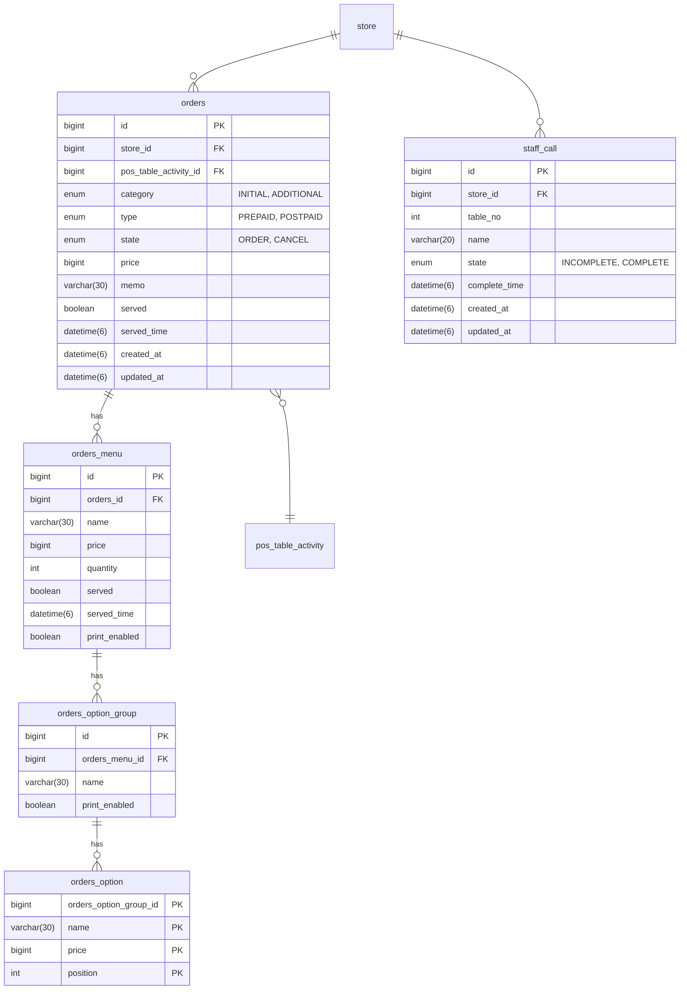

---

## 주문 결제

_orders_payment_

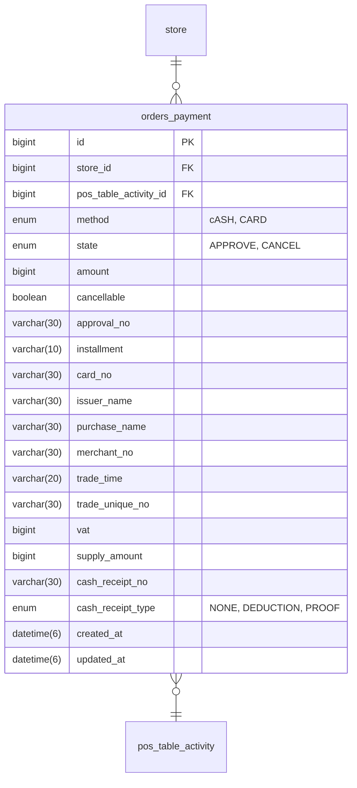

---

## POS

_pos_table_

_pos_table_activity_

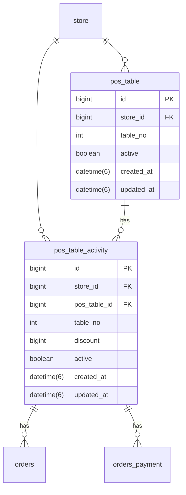

---
