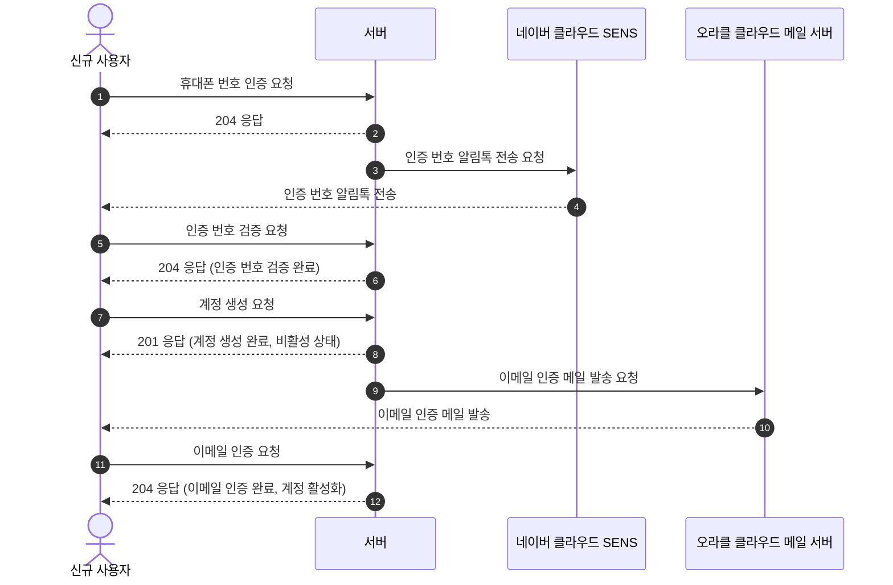
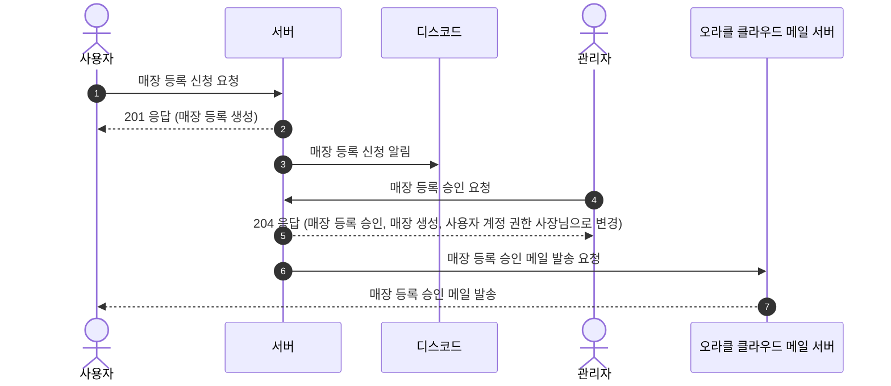
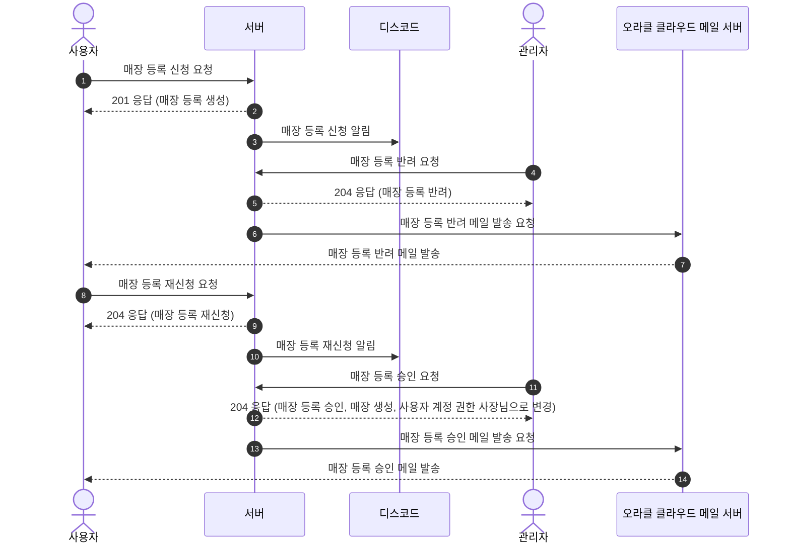
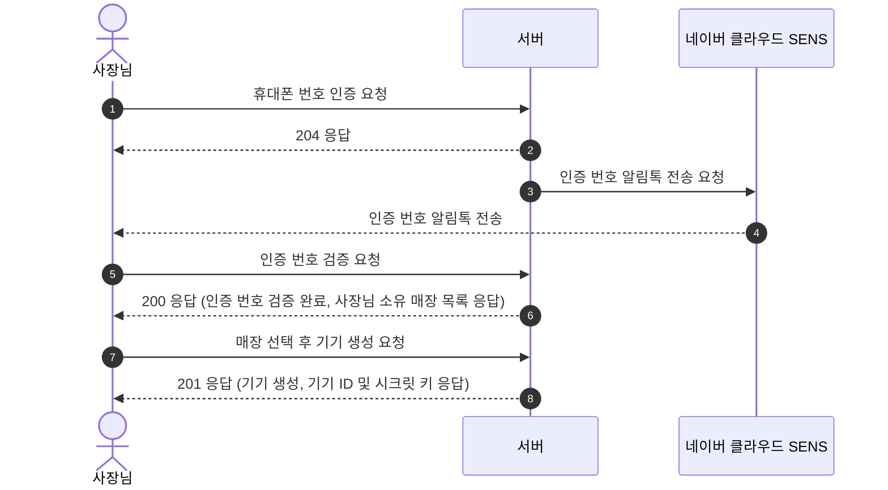
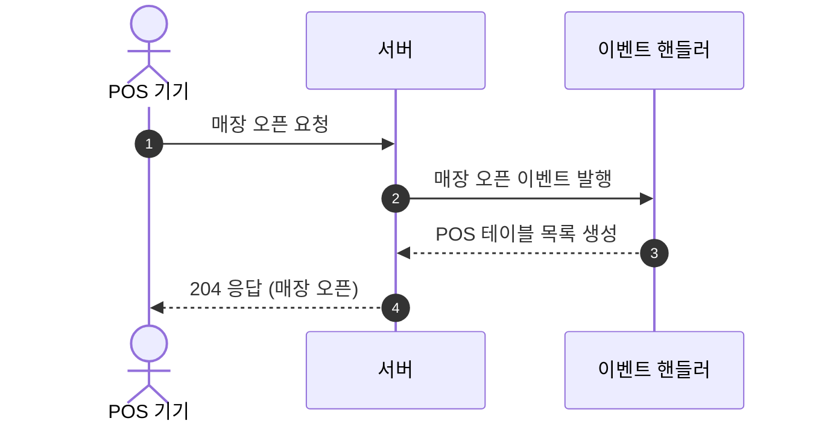
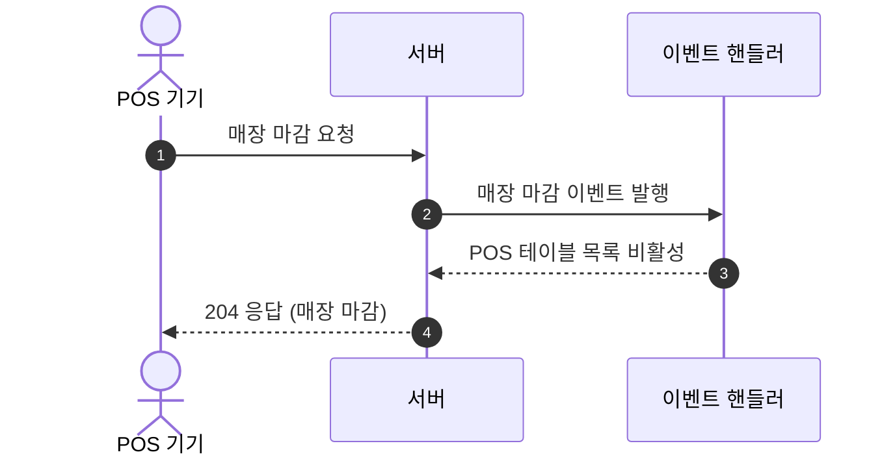
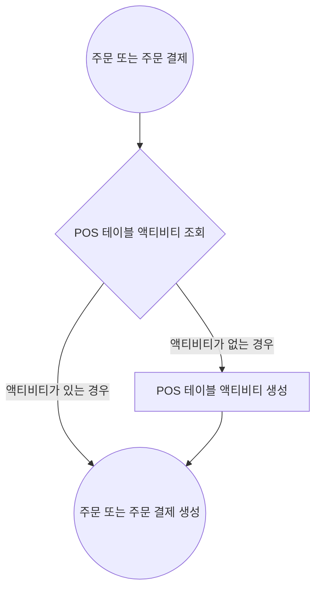
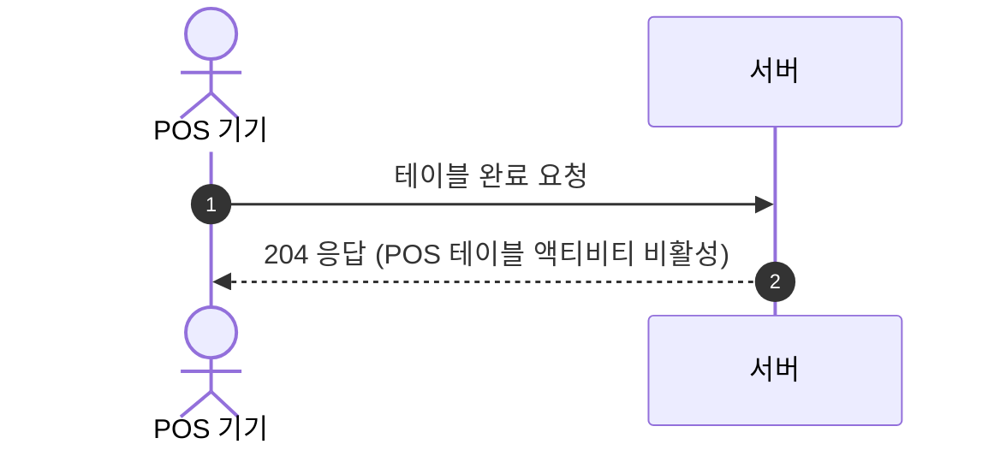
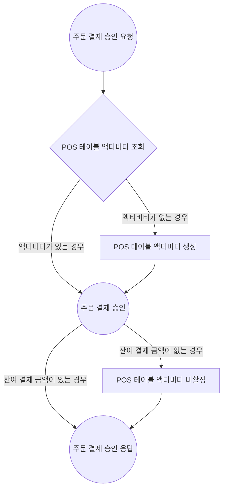

# UML

모두의 웨이터 중요 도메인 흐름을 UML 다이어그램으로 정리한 문서입니다.

---

## 목차

- [계정 생성](#계정-생성)
- [매장 등록](#매장-등록)
- [기기 생성](#기기-생성)
- [POS](#POS)

---

## 계정 생성

---

## 매장 등록

### 신청 -> 승인

### 신청 -> 반려 -> 재신청 -> 승인

---

## 기기 생성

---

## POS

### POS 테이블 목록 생성

### POS 테이블 목록 비활성

### POS 테이블 액티비티 생성

### POS 테이블 액티비티 비활성

#### 선결제 테이블인 경우

#### 후결제 테이블인 경우

---
